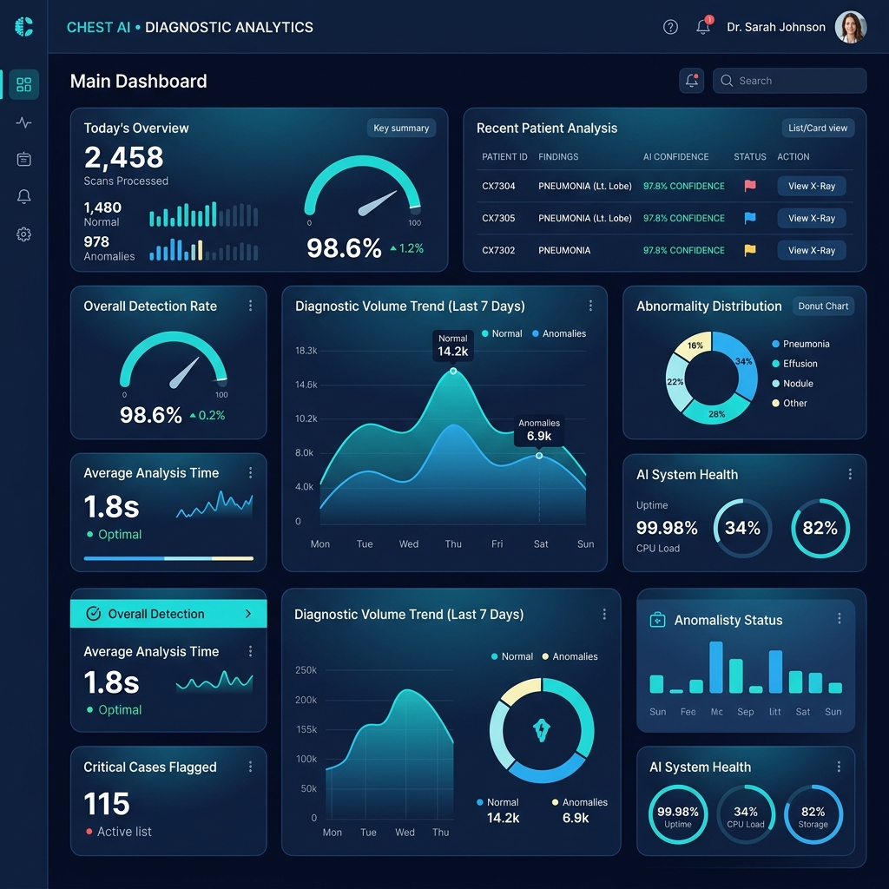
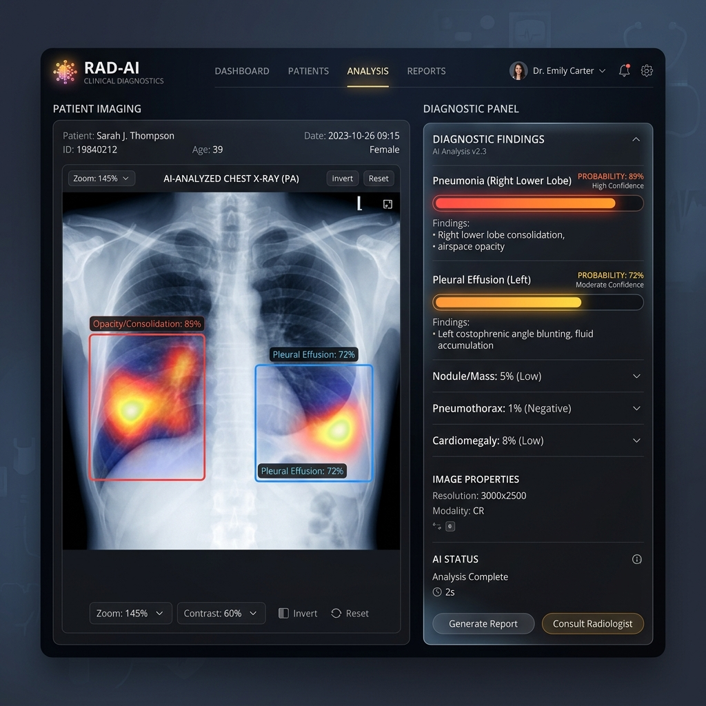

# 🛡️ ClarityX — Chest X-Ray AI Diagnostics System
### نظام تشخيص وتحليل الأشعة السينية للصدر بالذكاء الاصطناعي

[](https://github.com/)
[](https://nextjs.org)
[](https://fastapi.tiangolo.com)
[](https://github.com/facebookresearch/ConvNeXt)

ClarityX is a modern full-stack medical diagnostics platform for chest X-ray analysis. It combines a polished React/Next.js frontend with a Python FastAPI backend to deliver:

- AI-powered chest X-ray classification
- Localized bounding boxes and heatmaps
- Patient management and clinical history
- Automated PDF medical reports
- Supabase authentication and data storage

---

## 📸 Project Preview

| Dashboard | AI Analysis |
| :---: | :---: |
|  |  |

---

## ✨ What Makes ClarityX Professional

- Clean and responsive UI built with **Next.js**, **Tailwind CSS**, and **Shadcn UI**
- Fast image inference via **FastAPI** and **PyTorch**
- Support for heatmaps, bounding boxes, and dynamic model outputs
- Supabase-powered user/session management
- Report generation directly from the app

---

## 🧠 Features

### Frontend
- Patient record dashboard
- X-ray upload and preview
- Interactive heatmap overlays
- Clinical report generation (PDF)
- Search, filter, and result tracking

### Backend
- FastAPI inference server
- ConvNeXt Large model integration
- GPU/CPU fallback support
- Image preprocessing and bounding box generation
- Secure data APIs for patient and report storage

---

## 🛠️ Tech Stack

| Layer | Tools |
| --- | --- |
| Frontend | Next.js, React, TypeScript, Tailwind CSS, Framer Motion |
| Backend | Python, FastAPI, Uvicorn, PyTorch, TorchVision, timm |
| Database | Supabase (PostgreSQL, Auth, Storage) |
| Reporting | jsPDF, jsPDF-AutoTable |

---

## 🚀 Quick Start

### 1. Frontend

```bash
cd C:\ClarityX
npm install
npm run dev
```

Open: `http://localhost:3000`

### 2. Backend

```bash
cd C:\ClarityX\python-backend
python -m venv .venv
.venv\Scripts\activate
pip install -r requirements.txt
python model_server.py
```

Open: `http://localhost:5000`

---

## 📁 Repository Structure

- `app/` — Next.js application routes and pages
- `components/` — Reusable UI components
- `lib/` — Frontend helpers and Supabase integration
- `python-backend/` — FastAPI server and model inference code
- `public/images/` — Demo screenshots and assets
- `supabase_schema.sql` — Database schema for Supabase setup

---

## 📦 Backend Requirements

Install backend dependencies from:

```bash
cd python-backend
pip install -r requirements.txt
```

---

## 📌 Publish to GitHub

Use this workflow to create a clean GitHub repository:

```bash
git init
git add .
git commit -m "Initial commit — ClarityX AI Chest X-Ray Diagnostics"
git branch -M main
git remote add origin https://github.com/<username>/ClarityX.git
git push -u origin main
```

> Make sure your `.gitignore` prevents committing `node_modules/`, `.venv/`, logs, and model weights.

---

## 📝 Notes

- Keep sensitive credentials out of GitHub. Use environment variables for Supabase keys.
- If you use a GPU, the backend will accelerate inference automatically.
- Run `npm audit fix` periodically to keep frontend dependencies secure.

---

## ⚠️ Disclaimer

This project is intended as a prototype and educational tool. Any medical diagnosis must be verified by licensed healthcare professionals.

تم تطوير هذا المشروع كنموذج أولي تعليمي، ويجب أن يتم التحقق من أي تشخيص طبي بواسطة أخصائي صحي معتمد.
