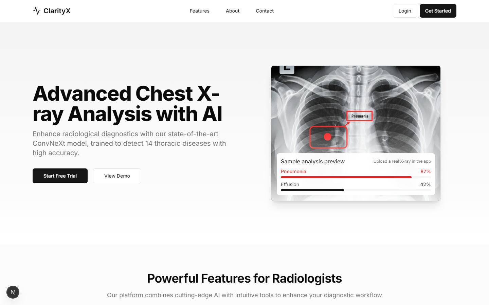
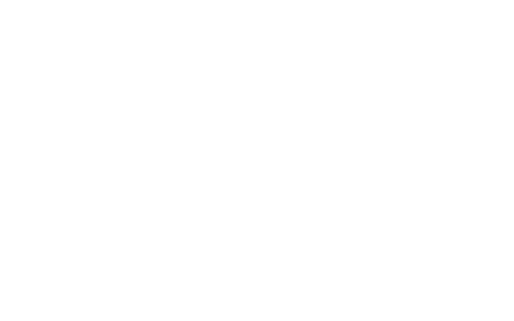
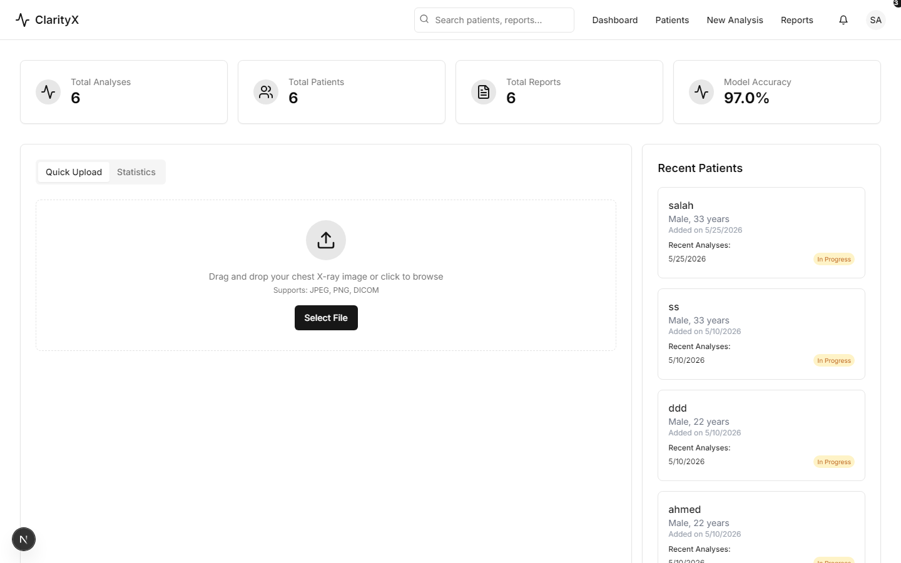
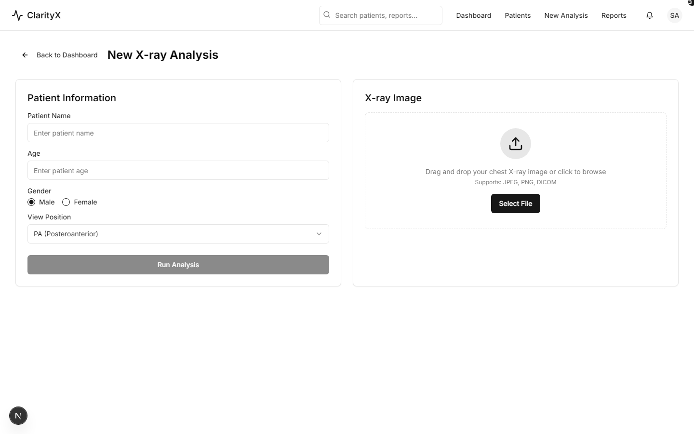
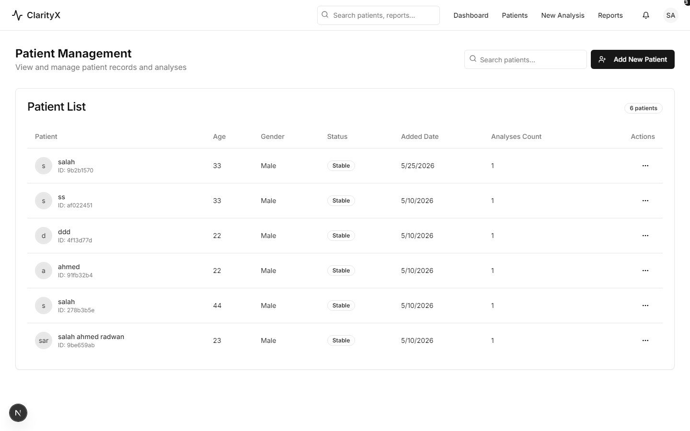
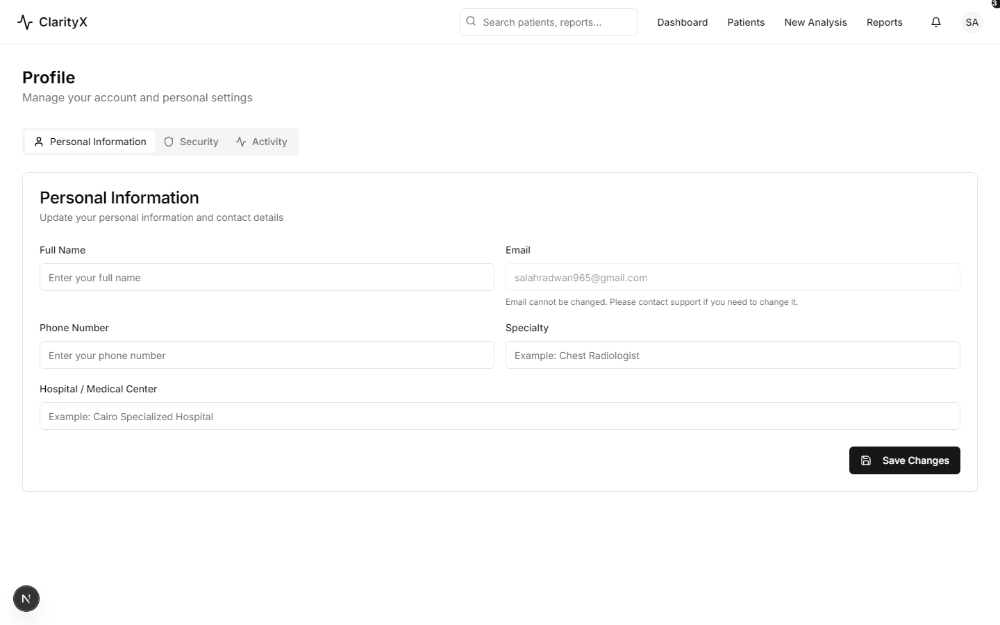
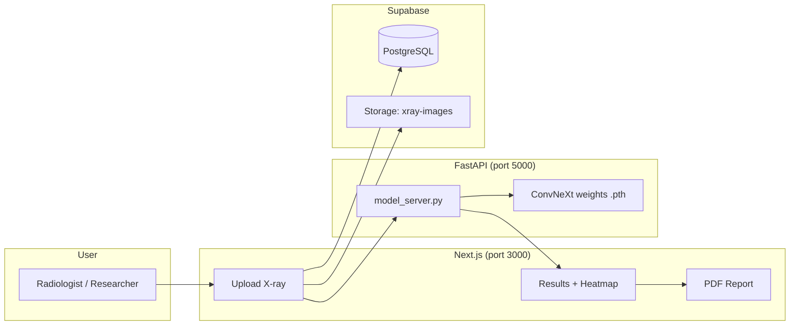

# ClarityX

**AI-powered chest X-ray diagnostics** — full-stack web platform for multi-label pathology detection, heatmap visualization, patient records, and clinical PDF reports.

[](https://nextjs.org)
[](https://fastapi.tiangolo.com)
[](https://pytorch.org)
[](https://supabase.com)

> **Medical disclaimer:** ClarityX is a research and educational prototype. All findings must be reviewed by licensed clinicians before clinical use.

---

## Table of contents

1. [Overview](#overview)
2. [Features](#features)
3. [Architecture](#architecture)
4. [End-to-end workflow](#end-to-end-workflow)
5. [Prerequisites](#prerequisites)
6. [Installation](#installation)
7. [Configure Supabase](#configure-supabase)
8. [Model weights](#model-weights)
9. [Run the application](#run-the-application)
10. [Using the web app (upload → PDF report)](#using-the-web-app-upload--pdf-report)
11. [API reference](#api-reference)
12. [Project structure](#project-structure)
13. [Publish to GitHub](#publish-to-github)
14. [References](#references)

---

## Overview

ClarityX combines:

| Layer | Technology | Role |
|-------|------------|------|
| **Frontend** | Next.js 15, React 19, Tailwind, shadcn/ui | Dashboard, upload UI, heatmaps, PDF export |
| **Inference API** | FastAPI, PyTorch, timm | Real-time X-ray classification + bounding boxes |
| **Database** | Supabase (PostgreSQL + Auth + Storage) | Users, patients, analyses, results |
| **Training** | `model-training/` scripts | NIH ChestX-ray14 preprocessing and ConvNeXt training |

The model detects **14 thoracic conditions** (NIH ChestX-ray14 labels) and localizes **8** of them with bounding boxes. Mean validation AUROC is approximately **0.97**.

---

## Screenshots

<p align="center">
  
  <br /><em>Landing page</em>
</p>

<p align="center">
  
  <br /><em>Login</em>
</p>

<p align="center">
  
  <br /><em>Dashboard</em>
</p>

<p align="center">
  
  <br /><em>New analysis — upload X-ray</em>
</p>

<p align="center">
  
  <br /><em>Patients</em>
</p>

<p align="center">
  
  <br /><em>Reports</em>
</p>

<p align="center">
  
  <br /><em>Profile</em>
</p>

> To regenerate screenshots locally (credentials via environment variables only):
>
> ```bash
> set SCREENSHOT_EMAIL=your@email.com
> set SCREENSHOT_PASSWORD=your-password
> npm run dev
> npm run screenshots
> ```

---

## Features

- **Multi-label AI analysis** — ConvNeXt Large with attention, metadata (age, sex, view), and localization head
- **Interactive results** — heatmaps, bounding-box overlays, 3D view, comparison with prior scans
- **Patient management** — register patients, track analysis history
- **PDF clinical reports** — one-click download from the results page (jsPDF + heatmap snapshots)
- **Secure auth** — Supabase email/password with row-level security
- **Reproducible training pipeline** — preprocessing, balancing, and fine-tuning scripts included

---

## Architecture



---

## End-to-end workflow

This is the full path from raw data to a PDF report on your local site.

### 1. Download the dataset

ClarityX is trained on the **[NIH ChestX-ray14](https://www.nih.gov/news-events/news-releases/nih-clinical-center-provides-one-largest-publicly-available-chest-x-ray-datasets-scientific-community)** dataset (~112,000 frontal chest X-rays).

1. Request access and download from the NIH Box archive:  
   **https://nihcc.app.box.com/v/ChestXray-NIHCC**
2. Extract all image archives into a single folder, e.g. `model-training/data/images/`
3. Download **`Data_Entry_2017.csv`** (image labels and patient metadata) into `model-training/data/`

Expected layout:

```
model-training/data/
├── Data_Entry_2017.csv
└── images/          # PNG files referenced by the CSV
    ├── 00000001_000.png
    └── ...
```

> Optional: [BBox annotations](https://www.kaggle.com/datasets/nih-chest-xrays/data) for localization can be merged using scripts in `model-training/utils/bbox_utils.py`.

### 2. Preprocess the data

```bash
cd model-training
python -m utils.preprocessing \
  --data_path ./data/Data_Entry_2017.csv \
  --image_folder ./data/images \
  --output_folder ./preprocessed \
  --balanced
```

This resizes images, binarizes multi-labels, balances classes, and writes train/test tensors for training.

### 3. Train or fine-tune the model (optional)

```bash
cd model-training
pip install torch torchvision timm albumentations opencv-python scikit-learn pandas numpy matplotlib tqdm

python fast_train_convnext.py \
  --data_dir ./preprocessed \
  --output_dir ./runs \
  --batch_size 4 \
  --epochs 30
```

Checkpoints are saved as `best_model_epoch_*_auroc_*.pth`. Copy your best file to `python-backend/` (see [Model weights](#model-weights)).

### 4. Deploy inference + web app

Follow [Installation](#installation) and [Run the application](#run-the-application) below.

### 5. Analyze an X-ray in the browser

1. Register / sign in  
2. **Analysis** → enter patient info → upload PNG/JPG  
3. View **Results** with heatmaps and probabilities  
4. Click **Download PDF Report**

### 6. PDF report contents

Generated by `components/pdf-report-generator.tsx`:

| Section | Content |
|---------|---------|
| Header | Hospital name, report date, report ID |
| Patient | Name, age, gender, view position (PA/AP) |
| Findings table | Disease, probability, clinical notes |
| Imaging | X-ray thumbnail + per-condition heatmaps |
| Footer | Radiologist profile, disclaimer |

Reports are saved locally via browser download (no server-side PDF storage required).

---

## Prerequisites

| Tool | Version |
|------|---------|
| Node.js | 18+ |
| Python | 3.10+ |
| npm or pnpm | latest |
| CUDA GPU | recommended for training/inference |
| Supabase account | free tier is sufficient |

---

## Installation

### Frontend

```bash
git clone https://github.com/<your-username>/ClarityX.git
cd ClarityX
npm install
cp .env.example .env.local
# Edit .env.local with your Supabase keys
```

### Backend

```bash
cd python-backend
python -m venv .venv

# Windows
.\.venv\Scripts\activate
# macOS / Linux
source .venv/bin/activate

pip install -r requirements.txt
```

---

## Configure Supabase

1. Create a project at [supabase.com](https://supabase.com)
2. Open **SQL Editor** → run the full script in [`supabase_schema.sql`](supabase_schema.sql)
3. Enable **Email** auth under Authentication → Providers
4. Copy **Project URL** and **anon public key** into `.env.local`:

```env
NEXT_PUBLIC_SUPABASE_URL=https://xxxx.supabase.co
NEXT_PUBLIC_SUPABASE_ANON_KEY=eyJhbG...
NEXT_PUBLIC_MODEL_API_ENDPOINT=http://localhost:5000/predict
```

Tables created: `profiles`, `patients`, `analyses`, `results`, plus storage bucket `xray-images`.

---

## Model weights

Weights are **not** in Git (see `.gitignore`). Place your checkpoint here:

```
python-backend/best_model_epoch_27_auroc_0.9689.pth
```

Details: [`docs/MODEL_WEIGHTS.md`](docs/MODEL_WEIGHTS.md)

Verify:

```bash
cd python-backend
python model_server.py
# → http://localhost:5000/healthcheck
```

---

## Run the application

Open **two terminals**:

**Terminal 1 — Inference API**

```bash
cd python-backend
.\.venv\Scripts\activate    # Windows
python model_server.py
```

**Terminal 2 — Web app**

```bash
cd ClarityX
npm run dev
```

| Service | URL |
|---------|-----|
| Web app | http://localhost:3000 |
| Model API | http://localhost:5000 |
| Health check | http://localhost:5000/healthcheck |

---

## Using the web app (upload → PDF report)

| Step | Page | Action |
|------|------|--------|
| 1 | `/register` or `/login` | Create an account |
| 2 | `/dashboard` | Overview of patients and analyses |
| 3 | `/analysis` | Enter patient demographics, upload X-ray (drag & drop) |
| 4 | `/results/[id]` | Review AI predictions, heatmaps, bounding boxes |
| 5 | Same page | **Download PDF Report** — saves `DiagnoLink` branded PDF |
| 6 | `/reports` | List past analyses; re-open or download again |
| 7 | `/patients` | Manage patient records and history |

**Tips**

- Use **PA** or **AP** view position — the model uses this metadata
- Ensure `model_server.py` is running before uploading; otherwise analysis may fail
- Add doctor notes on the results page — they appear in the PDF

---

## API reference

### `POST /predict` (FastAPI)

| Field | Type | Description |
|-------|------|-------------|
| `image` | file | Chest X-ray (PNG/JPG) |
| `age` | int | Patient age |
| `sex` | int | `0` = female, `1` = male |
| `view_position` | int | `0` = PA, `1` = AP |

**Response (example):**

```json
{
  "detections": {
    "pneumonia": 0.82,
    "effusion": 0.61
  },
  "boxes": {
    "pneumonia": { "x": 0.45, "y": 0.4, "width": 0.3, "height": 0.35 }
  }
}
```

---

## Project structure

```
ClarityX/
├── app/                    # Next.js App Router pages
│   ├── analysis/           # Upload & run inference
│   ├── results/[id]/       # Heatmaps + PDF button
│   ├── reports/            # Report history
│   ├── patients/           # Patient CRUD
│   └── api/                # Next.js API routes
├── components/             # UI + pdf-report-generator.tsx
├── lib/                    # Supabase client, chest_model.ts
├── python-backend/         # FastAPI inference server
├── model-training/         # Dataset prep + training scripts
├── public/                 # Static assets (placeholder.svg only)
├── supabase_schema.sql     # Database bootstrap
├── docs/MODEL_WEIGHTS.md   # Checkpoint setup guide
└── .env.example            # Environment template
```

---

## Publish to GitHub

```bash
# From project root — ensure secrets and build output are not staged
git status

# Should NOT list: .next/, .env.local, *.pth, node_modules/, .venv/
git add .
git commit -m "Prepare ClarityX for open-source release"
git branch -M main
git remote add origin https://github.com/<username>/ClarityX.git
git push -u origin main
```

**Before pushing, confirm:**

- [ ] `.env.local` is not committed (use `.env.example` only)
- [ ] Model `.pth` files are excluded
- [ ] `.next/` build cache is excluded
- [ ] No API keys hardcoded in source (use environment variables)

---

## References

- Wang, X., et al. (2017). *ChestX-ray8: Hospital-scale Chest X-ray Database and Benchmarks.* CVPR.  
  https://arxiv.org/abs/1705.02315
- Liu, Z., et al. (2022). *A ConvNet for the 2020s (ConvNeXt).* CVPR.
- NIH ChestX-ray14 dataset: https://nihcc.app.box.com/v/ChestXray-NIHCC

---

## License

MIT — see [LICENSE](LICENSE).
