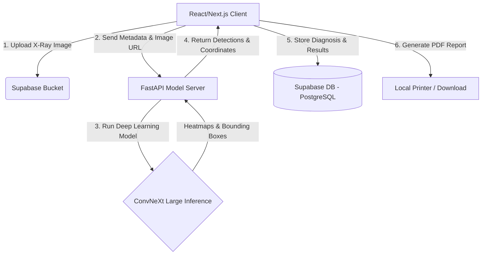

# 🛡️ ClarityX: Chest X-Ray AI Diagnostics System
### نظام تشخيص وتحليل الأشعة السينية للصدر بالذكاء الاصطناعي

ClarityX is an integrated, state-of-the-art medical diagnostics system designed to assist radiologists and physicians. By leveraging advanced Deep Learning (ConvNeXt Large) and high-performance APIs, ClarityX provides instant classification, localized bounding boxes, attention heatmaps for chest conditions, patient records tracking, and fully customized PDF medical report generation.

**نظام كلاريتي إكس (ClarityX)** هو نظام طبي متكامل يعتمد على الذكاء الاصطناعي المتقدم لمساعدة الأطباء وأخصائيي الأشعة. باستخدام تقنيات التعلم العميق (نموذج ConvNeXt Large) يتيح النظام تحليلاً فورياً لصور الأشعة السينية للصدر، تحديد المناطق المشتبه بإصابتها بخرائط حرارية تفاعلية ومربعات تحديد، متابعة سجلات المرضى وتاريخهم الطبي، وتوليد تقارير طبية شاملة بصيغة PDF بنقرة واحدة.

---

## 📸 System Showcase | معرض صور النظام

| 📊 Interactive Statistics Dashboard (لوحة التحكم الرئيسية) | 🔬 AI Analysis & Heatmaps (تحليل الأشعة والخرائط الحرارية) |
| :---: | :---: |
|  |  |

---

## ⚡ Core Features | المميزات الرئيسية

### 💻 Frontend (الواجهة الأمامية)
* **Dynamic Patient Management:** Complete system to add, search, and monitor patients' diagnostic history.
* **Interactive AI Heatmaps:** Fully interactive interface to overlay attention heatmaps (CAM) and bounding boxes, with dynamic opacity sliders.
* **High-Fidelity UI:** Modern, immersive dashboard in Dark/Light themes built using **React, Next.js, Tailwind CSS**, and **Framer Motion** micro-animations.
* **Automated PDF Generator:** Generate and export fully-designed, comprehensive clinical reports including patient metadata, detected condition confidence rates, and annotated X-rays.

### 🐍 Backend & AI (الخادم الخلفي والذكاء الاصطناعي)
* **High-Performance API:** Built with **FastAPI** to handle image processing and deep learning inference asynchronously.
* **Advanced Deep Learning:** Employs **ConvNeXt Large** model pre-trained on massive datasets (CheXpert) to identify up to 14 distinct chest conditions.
* **Dual Inference (Hybrid):** Standard PyTorch inference with automatic CPU/GPU acceleration, coupled with a robust **Mock Prediction Fallback** for local testing without large weights.
* **Secure Database & Storage:** Backed by **Supabase** for user authentication, patient tracking, structured analysis results, and secure medical file hosting.

---

## 🛠️ Technology Stack | التقنيات المستخدمة

| Layer | Technologies |
| :--- | :--- |
| **Frontend** | React 19, Next.js 15, TypeScript, Tailwind CSS, Framer Motion, Shadcn UI |
| **Backend** | Python 3.9+, FastAPI, Uvicorn, PyTorch, TorchVision, NumPy |
| **Database & Auth** | Supabase (PostgreSQL, Supabase Auth, Supabase Storage) |
| **PDF Reporting** | jsPDF, jsPDF-AutoTable |

---

## 🏗️ Project Architecture | بنية النظام



---

## 🚀 Setup & Running Guide | دليل التثبيت والتشغيل

### 1. Backend Server (الخادم الخلفي)

The backend runs on Python and provides the FastAPI AI inference server.
يعمل الخادم الخلفي بلغة بايثون ويقدم خدمات استدلال وتنبؤ نماذج الذكاء الاصطناعي عبر FastAPI.

```bash
# 1. Navigate to backend directory | انتقل لمجلد الخادم الخلفي
cd python-backend

# 2. Set up virtual environment | إعداد البيئة الافتراضية
python -m venv .venv
# On Windows (لتفعيلها على ويندوز):
.venv\Scripts\activate
# On Linux/Mac (لتفعيلها على لينكس/ماك):
source .venv/bin/activate

# 3. Install required libraries | تثبيت المكتبات البرمجية المطلوبة
pip install -r requirements.txt
# If requirements.txt is not present, install manually:
pip install fastapi uvicorn torch torchvision timm numpy pillow python-multipart

# 4. Start the FastAPI server | تشغيل خادم بايثون
python model_server.py
```
> **Note:** The server starts automatically at `http://localhost:5000`. You can check server health at `http://localhost:5000/healthcheck`.
> **ملاحظة:** سيعمل الخادم تلقائياً على المنفذ 5000. يمكنك التحقق من جاهزية الخدمة عبر الرابط `/healthcheck`.

---

### 2. Frontend Web App (الواجهة الأمامية)

The web client is built with Next.js and React.
الواجهة الأمامية مبنية باستخدام Next.js و React.

```bash
# 1. Install Node.js dependencies | تثبيت الحزم البرمجية
npm install

# 2. Run the local development server | تشغيل التطبيق محلياً
npm run dev
```
> Open [http://localhost:3000](http://localhost:3000) in your browser to view the application.
> افتح الرابط [http://localhost:3000](http://localhost:3000) في متصفحك لتصفح وتشغيل النظام بالكامل.

---

## 🗄️ Database Schema | هيكل قاعدة البيانات (Supabase)

The system stores patient and clinical analysis records in a **PostgreSQL** instance managed by **Supabase**.
يخزن النظام سجلات المرضى والتحليلات الإكلينيكية في قاعدة بيانات **PostgreSQL** مدارة عبر **Supabase**.

1. **`patients`**: Stores basic patient records (ID, Name, Age, Gender, Created At).
2. **`analyses`**: Logs every X-Ray scan session (ID, Patient ID, Image URL, View Position PA/AP).
3. **`results`**: Saves the deep learning diagnosis, confidence levels, and coordinate boxes.
4. **`profiles`**: User profiles (Doctors/Administrators) linked to Supabase authentication.

The schema sql script is fully documented in `supabase_schema.sql` for quick database migration setup.
ملف السيكوال الكامل متوفر في `supabase_schema.sql` لتهيئة قاعدة البيانات في ثوانٍ معدودة.

---

## 🧠 AI Model & Inference | نموذج الذكاء الاصطناعي

The core model is a fine-tuned **ConvNeXt Large** network trained on chest radiographs.
النموذج البرمجي الأساسي هو شبكة **ConvNeXt Large** تم تدريبها وتعديلها خصيصاً على مئات الآلاف من صور الأشعة السينية للصدر.

* **Detected Conditions (الأمراض المكتشفة):** Atelectasis, Cardiomegaly, Effusion, Infiltration, Mass, Nodule, Pneumonia, Pneumothorax, Consolidation, Edema, Emphysema, Fibrosis, Pleural Thickening, Hernia.
* **Model Optimization:** The system automatically checks for CUDA-enabled GPUs for lightning-fast sub-second inference. If no GPU is available, it falls back to CPU execution or mock clinical predictions for offline testing.

---

## 📝 License & Disclaimer | ترخيص وإخلاء مسؤولية

This system is developed as an AI-assistant prototype for educational and research purposes. All diagnoses should be verified by a certified healthcare professional.
تم تطوير هذا النظام كنموذج أولي مساعد للأطباء لأغراض تعليمية وبحثية. أي تشخيص طبي يقدمه النظام يجب مراجعته واعتماده بالكامل من طبيب بشري مختص.
